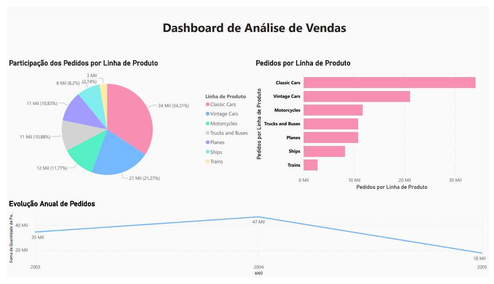

# 📊 Dashboard de Análise de Vendas - Power BI

Dashboard criado no Power BI para treinar visualização de dados, focado em:

✅ Gráfico de Pizza (participação dos pedidos por linha de produto)  
✅ Gráfico de Barras Horizontais (quantidade de pedidos por linha de produto)  
✅ Gráfico de Linhas (evolução anual de pedidos)

O meu objetivo foi desenvolver habilidades em:

- Criação de dashboards interativos
- Escolha de paleta de cores harmônicas
- Ajuste de títulos, rótulos e plano de fundo
- Exportação em PDF para portfólio

## 🛠️ Tecnologias Utilizadas
- Power BI Desktop
- Limpeza e visualização de dados
- Exportação de relatórios para PDF

## ✨ Captura de tela do Dashboard

---

📈 **Projeto de portfólio de Ciência de Dados / Análise de Dados.**

